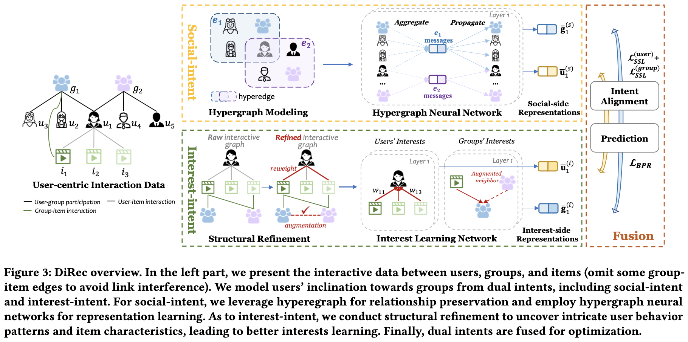
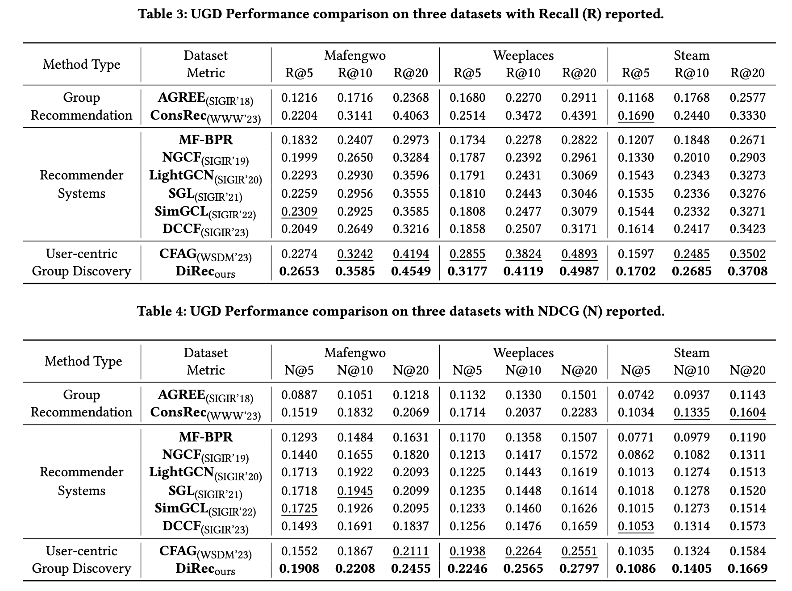

# CIKM2023DiRec

This is the official code for CIKM 2023 Long Paper:

**Dual Intents Graph Modeling for User-centric Group Discovery**

Our paper has been released on arXiv now ([Paper Link](https://arxiv.org/abs/2308.05013))！

Other Mateirals: [Pre-recorded Video](https://www.bilibili.com/video/BV1H84y1d7Cc)  [Full Paper](https://dl.acm.org/doi/pdf/10.1145/3583780.3614855)





## Cite

If you make advantage of DiRec in your research, please cite the following in your manuscript:
```
@inproceedings{wu2023direc,
  title={Dual Intents Graph Modeling for User-centric Group Discovery},
  author={Wu, Xixi and Xiong, Yun and Zhang, Yao and Jiao, Yizhu and Zhang, Jiawei},
  booktitle={Proceedings of the 32nd ACM International Conference on Information and Knowledge Management(CIKM)},
  year={2023},
  organization={ACM}
}
```


## Contents in This Repo

In `DiRec` folder, we provide the implementation of **DiRec model**.

In `data` folder, we provide all three experimental datasets. For more details, you can see that folder's README file.

In `baselines` folder, we also release our implementations of **all baseline** models. We consider three types of baseline models: Group Recommendation (GR) models, Recommender Models (RS), and User-centric Group Discovery (UGD) models. We provide the implementation of all **9** baselines compared by our paper. 

```.
├── DiRec                   (DiRec Implementation)
│   ├── dataloader.py
│   ├── datautil.py
│   ├── main.py
│   ├── metrics.py
│   ├── model.py
│   └── run.sh
├── README.md
├── baselines
│   ├── CFAG                (UGD baseline)
│   ├── GRModels            (GR baselines, AGREE and ConsRec)
│   │   ├── AGREE
│   │   ├── ConsRec
│   └── RSModels            (RS baselines, including MF-BPR, NFCG, LightGCN, SGL, SimGCL, DCCF)
├── data
│   ├── Mafengwo
│   ├── README.md
│   ├── Steam
│   └── Weeplace
└── figs
```
## Dependencies


* Python3
* PyTorch 1.13.0
* PyTorch-Geometric 2.3.1
> Note that it may need to appropriately install the package torch-geometric based on the CUDA version (or CPU version if GPU is not available). Please refer to the official website https://pytorch-geometric.readthedocs.io/en/latest/notes/installation.html for more information of installing prerequisites.
* scipy 1.10.1


## Reproducibility

Use `run.sh` in `DiRec`/`baseline` folders  to run the codes and reproduce the published results.




